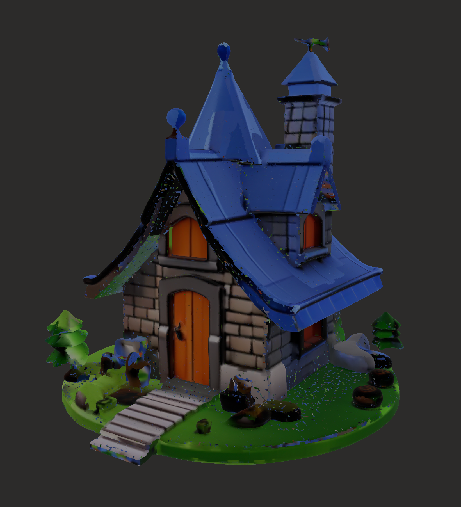

# Hunyuan3D on Apple Silicon M{PS, LX}

Full reference implementation of Hunyuan3D inference on native Apple Silicon, including MLX texturing. 

**Project/docs are a WIP and all contributions are welcome.** Writup on all the optimizations that was done coming soon (i.e. some work trimming down CPU UV Unwrapping, among other kernel stuff)


This is a continuation of a months long attempt to port Hunyuan3D-Paint to MPS, read about my first failed attempt in December [here](https://blog.zimengxiong.com/#post/porting-hunyuan3d-2-texture-generation-to-apple-silicon-mps).



---

## ComfyUI

There is also a standalone ComfyUI custom node package in [hy3d_mlx_comfyui](hy3d_mlx_comfyui/).

It includes separate shape and paint nodes, with paint limited to `hunyuan3d-paint-v2-0` and `hunyuan3d-paint-v2-0-turbo`.

Install and usage notes: [hy3d_mlx_comfyui/README.md](hy3d_mlx_comfyui/README.md)

---

## Supported Models

| Model | Type | MPS | MLX | MLX HF |
| - | - | - | - | - |
| hunyuan3d-dit-v2-mini | 🧱 Shape | ✅ | 🏗️ | |
| hunyuan3d-dit-v2-mini-turbo | 🧱 Shape | ✅ | 🏗️ | |
| hunyuan3d-dit-v2-0 | 🧱 Shape | ✅ | 🏗️ | |
| hunyuan3d-dit-v2-0-turbo | 🧱 Shape | ✅ | 🏗️ | |
| hunyuan3d-dit-v2-1 | 🧱 Shape | ✅ | 🏗️ | |
| hunyuan3d-dit-v2-mv | 🧱 Shape | ✅ | 🏗️ | |
| hunyuan3d-dit-v2-mv-turbo | 🧱 Shape | ✅ | 🏗️ | |
| hunyuan3d-paint-v2-0 | 🎨 Paint | ✅ | ✅ | [zimengxiong/Hunyuan3D-2.0-Paint-MLX](https://huggingface.co/zimengxiong/Hunyuan3D-2.0-Paint-MLX) |
| hunyuan3d-paint-v2-0-turbo | 🎨 Paint | ✅ | ✅ | [zimengxiong/Hunyuan3D-2.0-Paint-MLX](https://huggingface.co/zimengxiong/Hunyuan3D-2.0-Paint-MLX) |
| hunyuan3d-paintpbr-v2-1 | 🎨 Paint | ✅ | 🏗️ | [zimengxiong/Hunyuan3D-2.1-Paint-MLX](https://huggingface.co/zimengxiong/Hunyuan3D-2.1-Paint-MLX) |

---

## Caveats
- PyTorch/MPS paint can use very high unified memory and may OOM/kill on larger runs, so run paint with `--paint-diffusion-backend mlx`
- Quality is not as good as CUDA due to the immaturity of the libraries
- Currently writing the MLX pipeline to get shapes working, after that, 2.1 paint is priority.

---

## Setup / install

### 1) Prerequisites
- macOS on Apple Silicon
- Python 3.14
- [uv](https://docs.astral.sh/uv/)
- Xcode Command Line Tools (`xcrun` available)
- Hugging Face CLI auth (`hf auth login`)

### 2) Install
```bash
cd Hunyuan3D-MLX
uv sync
```

### 3) Smoke check
```bash
uv run python main.py --help
uv run python main.py shape --help
uv run python main.py paint --help
```

---

## Benchmarks
M4 Max 40c

| Task | Time |
| - |  - |
| Paint 2.0 (MLX) |  114.3s |
| Paint 2.0-turbo (MLX) |  62.6s |
| Paint 2.0 (MPS) | 302.4s |
| Paint 2.0-turbo (MPS) | 222.1s |
| Shape mini (MPS) | 86.8s |
| Shape mini-turbo (MPS) |  253.1s |

Notes:
- Turbo and non-turbo are different checkpoints, so outputs are not pixel-identical.
- MLX backend currently accelerates diffusion UNet path; renderer and some stages still use PyTorch components.
- MLX generally outperforms MPS, use MLX when possible
---

## Run with `main.py`

<details>
<summary><strong>Shape</strong></summary>

```bash
# default demo (penguin)
uv run python main.py shape

# explicit presets
uv run python main.py shape --shape-preset mini
uv run python main.py shape --shape-preset mini-turbo
uv run python main.py shape --shape-preset 2.0
uv run python main.py shape --shape-preset 2.0-turbo
uv run python main.py shape --shape-preset 2.1 --no-shape-safetensors

# multiview from images/mv/1
uv run python main.py shape --shape-preset mv mv 1
uv run python main.py shape --shape-preset mv-turbo mv 1
```
</details>

<details>
<summary><strong>Paint (recommended MLX)</strong></summary>

```bash
# 2.0 MLX (auto-pulls MLX weights from HF if not local)
uv run python main.py paint \
  --paint-preset 2.0 \
  --paint-diffusion-backend mlx \
  --mesh outputs/demo/demo_shape_mps.glb

# 2.0-turbo MLX (auto-pulls MLX weights from HF if not local)
uv run python main.py paint \
  --paint-preset 2.0-turbo \
  --paint-diffusion-backend mlx \
  --mesh outputs/demo/demo_shape_mps.glb

# optional explicit local override
uv run python main.py paint \
  --paint-preset 2.0-turbo \
  --paint-diffusion-backend mlx \
  --paint-mlx-weights converted/Hunyuan3D-2.0-Paint-MLX/2.0-turbo \
  --mesh outputs/demo/demo_shape_mps.glb
```
</details>

<details>
<summary><strong>Paint (PyTorch/MPS)</strong></summary>

```bash
uv run python main.py paint --paint-preset 2.0 --mesh outputs/demo/demo_shape_mps.glb
uv run python main.py paint --paint-preset 2.0-turbo --mesh outputs/demo/demo_shape_mps.glb
uv run python main.py paint --paint-preset 2.1 --mesh outputs/demo/demo_shape_mps.glb
```
</details>

<details>
<summary><strong>Full pipeline</strong></summary>

```bash
uv run python main.py full
uv run python main.py full mv 1

# full with MLX paint backend
uv run python main.py full \
  --shape-preset 2.0-turbo \
  --paint-preset 2.0-turbo \
  --paint-diffusion-backend mlx
```
</details>

---

## Per-model script runners

<details>
<summary><strong>Shape scripts</strong></summary>

```bash
uv run python shape/mini/gen.py
uv run python shape/mini/turbo/gen.py
uv run python shape/2.0/gen.py
uv run python shape/2.0/turbo/gen.py
uv run python shape/2.1/gen.py --no-shape-safetensors
uv run python shape/mv/gen.py mv 1
uv run python shape/mv/turbo/gen.py mv 1
```
</details>

<details>
<summary><strong>Paint scripts (MLX)</strong></summary>

```bash
uv run python paint/2.0/gen_mlx.py --mesh outputs/demo/demo_shape_mps.glb
uv run python paint/2.0/turbo/gen_mlx.py --mesh outputs/demo/demo_shape_mps.glb
uv run python paint/2.1/gen_mlx.py --mesh outputs/demo/demo_shape_mps.glb
```
</details>

<details>
<summary><strong>Paint scripts (PyTorch)</strong></summary>

```bash
uv run python paint/2.0/gen.py --mesh outputs/demo/demo_shape_mps.glb
uv run python paint/2.0/turbo/gen.py --mesh outputs/demo/demo_shape_mps.glb
uv run python paint/2.1/gen.py --mesh outputs/demo/demo_shape_mps.glb
```
</details>

---

## Optional: convert MLX weights yourself

```bash
# 2.0
uv run python paint/2.0/convert_mlx.py <path-to-hunyuan3d-paint-v2-0>

# 2.0-turbo
uv run python paint/2.0/turbo/convert_mlx.py <path-to-hunyuan3d-paint-v2-0-turbo>
```

## Credits
Derivative work of [Tencent](https://github.com/Tencent-Hunyuan/Hunyuan3D-2), [Lane et. al](https://arxiv.org/abs/2011.03277), and pedronaugusto.

Model and derivative models respect the `TENCENT HUNYUAN 3D 2.0 COMMUNITY LICENSE AGREEMENT`, see [legal](legal/hunyuan/)

All other work is licensed under [MIT](LICENSE).
